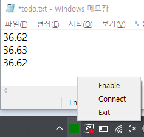

# blueint-k3pro-reader
It reads current temperature from the device LASER-K3PRO which connected by serial port.

LASER-K3PRO http://bluetrinc.cafe24.com/?p=2162

Simple practice for PyQt SystemTray program.


It shows green if connected successfully. Otherwise it shows grey colored box.

# Run
```
python main.py
```

# Test
```
py.test
```

# Build executable
```
build.bat
```